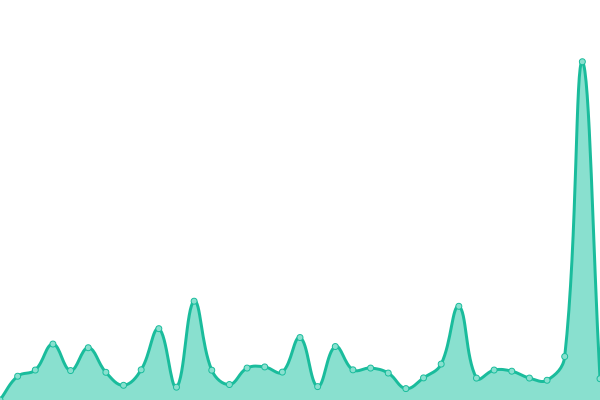
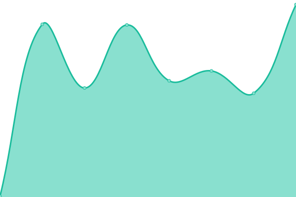
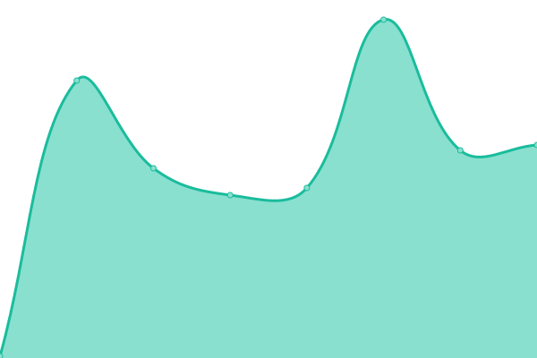

# [📈 Live Status](https://status.onnli.one): <!--live status--> **🟥 Complete outage**

This repository contains the open-source uptime monitor and status page for [OnnliOne](https://status.onnli.one), powered by [Upptime](https://github.com/upptime/upptime).

With [Upptime](https://upptime.js.org), you can get your own unlimited and free uptime monitor and status page, powered entirely by a GitHub repository. We use [Issues](https://github.com/OnnliOne/status/issues) as incident reports, [Actions](https://github.com/OnnliOne/status/actions) as uptime monitors, and [Pages](https://status.onnli.one) for the status page.

<!--start: status pages-->
<!-- This summary is generated by Upptime (https://github.com/upptime/upptime) -->
<!-- Do not edit this manually, your changes will be overwritten -->
<!-- prettier-ignore -->
| URL | Status | History | Response Time | Uptime |
| --- | ------ | ------- | ------------- | ------ |
|  [Landing Page](https://www.onnlione.com) | 🟥 Down | [landing-page.yml](https://github.com/OnnliOne/status/commits/HEAD/history/landing-page.yml) | 

 0ms
     
 | 

<a href="https://status.onnli.one/history/landing-page">0.00%</a>
    

|  [Page](https://page.onn.li) | 🟥 Down | [page.yml](https://github.com/OnnliOne/status/commits/HEAD/history/page.yml) | 

 0ms
     
 | 

<a href="https://status.onnli.one/history/page">0.00%</a>
    

|  [Email](https://mail.onn.li) | 🟥 Down | [email.yml](https://github.com/OnnliOne/status/commits/HEAD/history/email.yml) | 

 0ms
     
 | 

<a href="https://status.onnli.one/history/email">0.00%</a>
    

|  [Share](https://share.onn.li) | 🟥 Down | [share.yml](https://github.com/OnnliOne/status/commits/HEAD/history/share.yml) | 

 0ms
     
 | 

<a href="https://status.onnli.one/history/share">0.00%</a>
    

|  [Drop](https://drop.onn.li) | 🟥 Down | [drop.yml](https://github.com/OnnliOne/status/commits/HEAD/history/drop.yml) | 

 0ms
     
 | 

<a href="https://status.onnli.one/history/drop">0.00%</a>
    

<!--end: status pages-->

[**Visit our status website →**](https://status.onnli.one)

## 📄 License

- Powered by: [Upptime](https://github.com/upptime/upptime)
- Code: [MIT](./LICENSE) © [OnnliOne](https://status.onnli.one)
- Data in the `./history` directory: [Open Database License](https://opendatacommons.org/licenses/odbl/1-0/)
